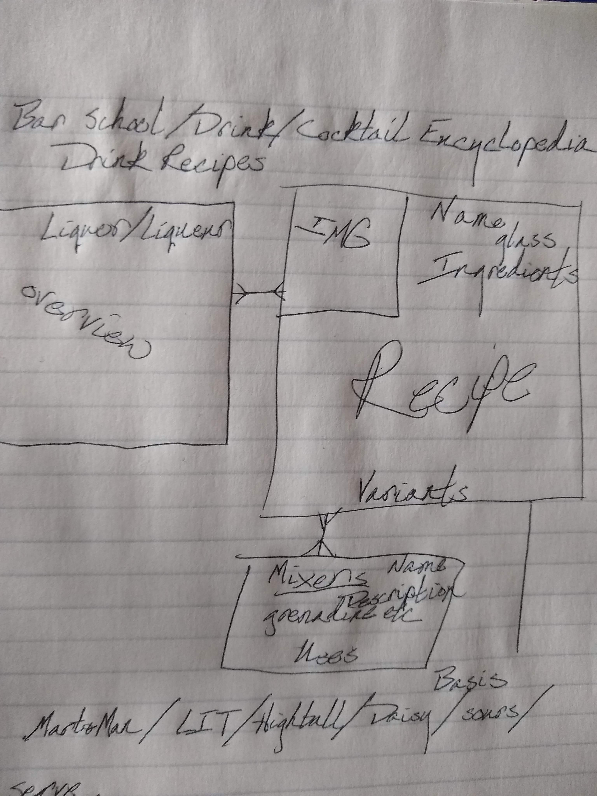

**Project-1-Cocktails**

This Cocktails app is an interactive community database of cocktail recipes built with the MERN stack. It's purpose is to be a quick reference for those in the bar community to learn from, add to, and edit.

[**Public Deployment**](https://shrouded-beach-63540.herokuapp.com/)

[**Project Board**](https://git.generalassemb.ly/users/DRHood/projects/1)

**ERD & Wireframe**

